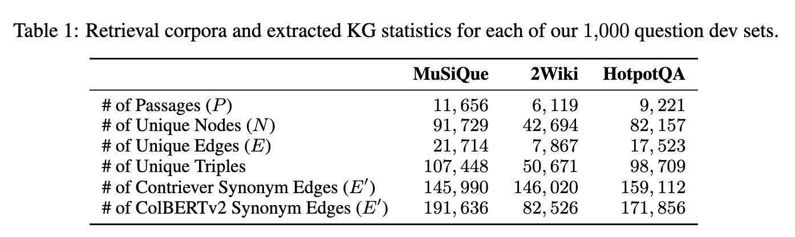
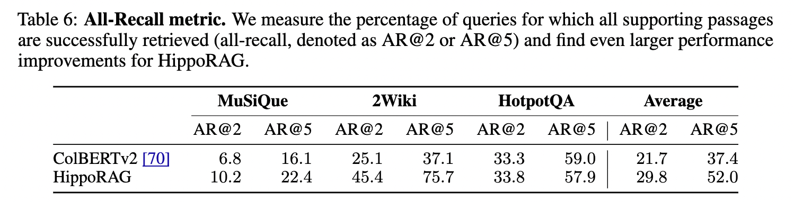

# HippoRAG: Neurobiologically Inspired Long-Term Memory for Large Language Models

**Authors:** Bernal Jimenez Gutierrez, Yiheng Shu, Yu Gu, Michihiro Yasunaga, Yu Su  
**Venue:** NeuRips 2024  
**Year:** 2026  
**Paper:** [https://arxiv.org/pdf/2405.14831v3](https://arxiv.org/pdf/2405.14831v3)  
**Category:** RAG  
**Tags:** `RAG`

---

## 📄 Abstract
In order to thrive in hostile and ever-changing natural environments, mammalian brains evolved to store large amounts of knowledge about the world and continually integrate new information while avoiding catastrophic forgetting. Despite the impressive accomplishments, large language models (LLMs), even with retrieval-augmented generation (RAG), still struggle to efficiently and effectively integrate a large amount of new experiences after pre-training. In this work, we introduce HippoRAG, a novel retrieval framework inspired by the hippocampal indexing theory of human long-term memory to enable deeper and more efficient knowledge integration over new experiences. HippoRAG synergistically orchestrates LLMs, knowledge graphs, and the Personalized PageRank algorithm to mimic the different roles of neocortex and hippocampus in human memory. We compare HippoRAG with existing RAG methods on multi-hop question answering and show that our method outperforms the state-of-the-art methods remarkably, by up to 20%. Single-step retrieval with HippoRAG achieves comparable or better performance than iterative retrieval like IRCoT while being 10-30 times cheaper and 6-13 times faster, and integrating HippoRAG into IRCoT brings further substantial gains. Finally, we show that our method can tackle new types of scenarios that are out of reach of existing methods. Code and data are available at this https URL.

---

## 🎯 Key Contributions

1. A RAG framework that serves as a long-term memory for LLMs 
2. Use an LLM to transform a corpus into a schemaless knowledge graph
3. Given a query, a HippoRag indetifies the key concepts in the query and runs  Personalized PageRank (PPR) algorithm on the KG

---

## 🔍 Motivation

1. LLMs struggle to integrate new information after pre-training
2. Typically, many real world tasks require knowledge integration across passages or documents
3. Standard multi-hop QA also requires integrating information between passages

---

## Methodology

1. Hippocampal Memory Indexing Theory provides a functional description of the components and circuitry involved in human long-term memory
2. Human long-term memory is composed of three components that work together to accomplish two main tasks
    - Pattern Separation: representations of distinct perceptual experiences are unique
    - Pattern Completion: retrieval of complete memories from partial stimuli
3. Pattern separation is accomplished in the memory encoding process
    - Neocortex receives the input and converts into more manipulatable, likely higher-level, features
    - This is routed through parahippocampal regions to be indexed by the Hippocampus
    - salient signals are included in the hippocampal index and associated with each other

### Architecture/Approach

#### Offline Indexing
1. LLM acts as neocortex to extract knowledge triplets from the documents
2. Dense encoders are used to additional edges between similar but not identical noun phrases
3. This adds extra set of synonym relations which are ot directly present in the passage

#### Online Retrieval
1. LLM extracts a set of named entities from query known as query named entities
2. These extracted entities are linked to nodes in the KG based on dense vectors to identify query nodes
3. All nodes whose representation is similar to the query entities are considered as query nodes
3. We need to activate relevant neighborhoods to become activated
4. Personalized PageRank distributes probability across a graph only through a set of user-defined source node
5. PPR gives a ranking score for each page

#### Node Specificity
1. IDF can improve information retrieval
2. Assume the set of passages from which node $i$ was extracted
3. Node specificity is used in retrieval by multiplying each query node probability with node specificity

---

## Experiments

### Dataset
1. MuSiQue
2. 2WikiMultiHopQA
3. HotpotQA

### Evaluation Metrics
They report retrieval and QA performance on the datasets using Recall@2 and Recall@5 for retrieval and exact match and F1 scores for QA

---

## 📊 Results

HippoRAG outperforms all other methods

### Ablations
#### Influence of LLM
Choice of LLMs matters in extracting entities

#### PPR Alternatives
PPR is essential for retrieving good neghborhood nodes

#### HippoRAG over Conventional RAG
1. HippoRAG is able to perform multi-hop retrieval in a single step
2. HippoRAG can retrieve relevant passages for a query requiring multi-step reasoning in a single step

---

## Limitations
While HippoRAG performs best on multi-hop datasets, it's performance on general QA datasets needs to be studied

## 🏷️ Tags for Reference

#rag

---

**Date Read:** 2026-05-04  
**Status:** ✅ Completed
