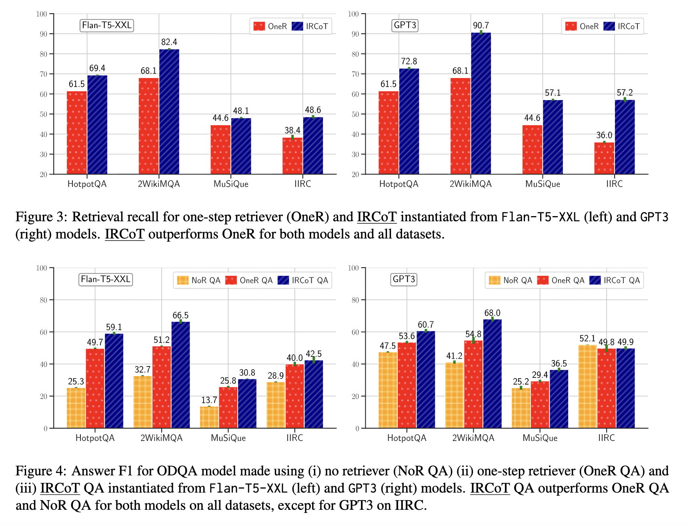

# Interleaving Retrieval with Chain-of-Thought Reasoning for Knowledge-Intensive Multi-Step Questions

**Authors:** Harsh Trivedi, Niranjan Balasubramanian, Tushar Khot, Ashish Sabharwal  
**Venue:** ACL 2023  
**Year:** 2026  
**Paper:** [https://aclanthology.org/2023.acl-long.557/](https://aclanthology.org/2023.acl-long.557/)  
**Category:** RAG  
**Tags:** `RAG`

---

## 📄 Abstract
Prompting-based large language models (LLMs) are surprisingly powerful at generating natural language reasoning steps or Chains-of-Thoughts (CoT) for multi-step question answering (QA). They struggle, however, when the necessary knowledge is either unavailable to the LLM or not up-to-date within its parameters. While using the question to retrieve relevant text from an external knowledge source helps LLMs, we observe that this one-step retrieve-and-read approach is insufficient for multi-step QA. Here, what to retrieve depends on what has already been derived, which in turn may depend on what was previously retrieved. To address this, we propose IRCoT, a new approach for multi-step QA that interleaves retrieval with steps (sentences) in a CoT, guiding the retrieval with CoT and in turn using retrieved results to improve CoT. Using IRCoT with GPT3 substantially improves retrieval (up to 21 points) as well as downstream QA (up to 15 points) on four datasets: HotpotQA, 2WikiMultihopQA, MuSiQue, and IIRC. We observe similar substantial gains in out-of-distribution (OOD) settings as well as with much smaller models such as Flan-T5-large without additional training. IRCoT reduces model hallucination, resulting in factually more accurate CoT reasoning.
---


## Motivation
1. LLMs are powerful at generating CoT for multi-step question answering, but struggle with outdated or missing knowledge.
2. One-step retrieve-and-read approach is insufficient for multi-step QA.
3. What to retrieve depends on what has already been derived which in turn depends on what was previously retrieved.

---
## 🎯 Key Contributions
1. Propose an interleaving approach where the idea is to use retrieval to guide CoT and use CoT to guide the retrieval process
2. Retrieve a set of base paragraphs using the query and alternate between the two steps
    - Extend CoT: QUestion, retrived paragraphs, CoT is used to generate the next CoT sentences
    - Expand Retrieved Information: use the last CoT sentence as query to retrieve more paragraphs

---

## 🔍 Methodology
1. Given a query, obtain K set of paragraphs using the retriever
2. Retrieval-guided reasoning step generates the next CoT sentence using the query, the paragraphs collected so far and CoT sentences generated so far
3. The prompt template looks like this:
```
Wikipedia Title: <Page Title>
<Paragraph Text>
...
Wikipedia Title: <Page Title>
<Paragraph Text>

Q: <Question>
A: <CoT Sentence 1> ... <CoT Sentence N>
```
4. For in-context demonstration ground-turth paragraph with a set of distractor paragraphs are used
5. For test query, paragraphs collected across all steps are used.
---

## 📊 Results

### Dataset
1. HotpotQA
2. 2WikiMultiHopQA
3. MuSiQue
4. IIRC

### Baselines
BM25 is the retriever

1. One-step Retriever
2. IRCoT Retriever

### Main Results
IRCoT outperforms One-step Retriever by a large margin



---

## 🏷️ Tags for Reference

#rag

---

**Date Read:** 2026-05-06  
**Status:** ✅ Completed
