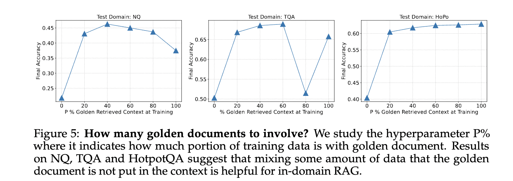

# RAFT: Adapting Language Model to Domain Specific RAG

**Authors:** Tianjun Zhang, Shishir G. Patil, Naman Jain, Sheng Shen  
**Venue:** COLM 2024  
**Year:** 2026  
**Paper:** [https://openreview.net/forum?id=rzQGHXNReU](https://openreview.net/forum?id=rzQGHXNReU)  
**Category:** RAG  
**Tags:** `RAG`

---

## 📄 Abstract
Pretraining Large Language Models (LLMs) on large corpora of textual data is now a standard paradigm. When using these LLMs for many downstream applications, it is common to additionally bake in new knowledge (e.g., time-critical news, or private domain knowledge) into the pretrained model either through RAG-based-prompting, or fine-tuning. However, the optimal methodology for the model to gain such new knowledge remains an open question. In this paper, we present Retrieval Augmented FineTuning (RAFT), a training recipe that improves the model's ability to answer questions in a "open-book" in-domain settings. In RAFT, given a question, and a set of retrieved documents, we train the model to ignore those documents that don't help in answering the question, which we call, distractor documents. RAFT accomplishes this by citing verbatim the right sequence from the relevant document that would help answer the question. This coupled with RAFT's chain-of-thought-style response helps improve the model's ability to reason. In domain-specific RAG, RAFT consistently improves the model's performance across PubMed, HotpotQA, and Gorilla datasets, presenting a post-training recipe to improve pre-trained LLMs to in-domain RAG. RAFT's code and demo are open-sourced at this http URL.


---

## 🎯 Key Contributions

1. Improve LLM's ability to answer questions in a "open-book" in-domain settings.
2. Given a question and a set of retrieved documents, train the model to ignore those documents that don't help in answering the question.
3. RAFT cites the information from the retrieved documents verbatim to answer the question.
4. Also, RAFT employs Chain-of-thought reasoning to generate the final answer.

---

## 🔍 Intuition

1. In-context Retrieval methods are equivalent to taking an open-book exam without studying the book.
2. Finetuning RAG models on a large corpus of documents is like studying the entire book before the exam.
3. Both methods fail in open-book nature of the test setting.

## Limitations of RAG

- RAG models are trained on a large corpus of documents, but they don't know which documents are relevant to a given question.
- RAG models are not good at ignoring irrelevant documents.
- RAG models are not good at generating the final answer based on the relevant documents.

## RAFT: RAG with Adaptive Fine-tuning

### SFT
In regular SFT, the LLM is finetuned on question-answer pairs from a dataset. Additionally, the LLM can also be finetuned on a set of retrieved documents, question and answer triplets.

### RAFT

- In RAFT, the training data contains a set of retrieved documents, a question, and a CoT style answer.
- The CoT style answer is generated from one or more of the documents referred to as golden documents.
- The set of retrieved documents can be classified into:
  - Golden documents: The documents that contains the correct answer.
  - Distractor documents: The documents that are not relevant to the question.
- For $P$ fraction of the instances, the golden document is retained along with the distractor documents in the training data.

    P % of data: Q + D∗ + D1 + D2 + . . . + Dk → A∗

    (1 − P) % of data: Q + D1 + D2 + . . . + Dk → A∗
- During testing, the model is provided wiyth question and the retrived documents and is prompted to generate the answer.
- Also, the CoT contains citations to the golden documents.

```
Question: The Oberoi family is part of a hotel company that has a head office
in what city?
context: [The Oberoi family is an Indian family that is famous for its
involvement in hotels, namely through The Oberoi Group]...[It is located in
city center of Jakarta, near Mega Kuningan, adjacent to the sister JW Marriott
Hotel. It is operated by The Ritz-Carlton Hotel Company. The complex has two
towers that comprises a hotel and the Airlangga Apartment respectively]...[The
Oberoi Group is a hotel company with its head office in Delhi.]
Instruction: Given the question, context and answer above, provide a logical
reasoning for that answer. Please use the format of: ##Reason: {reason}
##Answer: {answer}.
-------------------------------------------------------------------------------------CoT Answer: ##Reason: The document ##begin_quote## The Oberoi family is an
Indian family that is famous for its involvement in hotels, namely through The
Oberoi Group. ##end_quote## establishes that the Oberoi family is involved in
the Oberoi group, and the document ##begin_quote## The Oberoi Group is a hotel
company with its head office in Delhi. ##end_quote## establishes the head
office of The Oberoi Group. Therefore, the Oberoi family is part of a hotel
company whose head office is in Delhi. ##Answer: Delhi
```

---

## 📊 Results

### Main Results

- RAFT outperforms
    - Vanilla LLM with no documents
    - Vanilla LLM with documents
    - Domain-specific finetuning on QA pairs only
    - Domain-specific finetuning on QA pairs only but documents are provided during test time

### Ablation

- Finetuning with CoT leads to less overfitting and enhances the model's performance.
- Influence of P on RAFT:
    - Optimal P values ranges from 40% to 80%



---

## Limitations

- Performing RAFT without data replay leads to catastrophic forgetting.
- This is crucial for applications with tool calling capability.

---

**Date Read:** 2026-05-02  
**Status:** ✅ Completed
