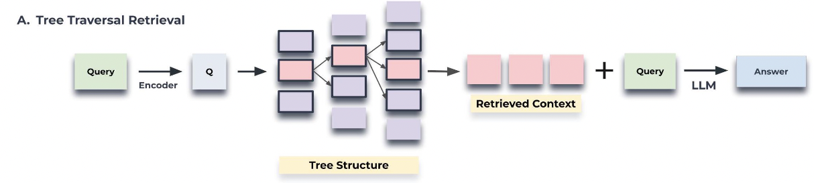
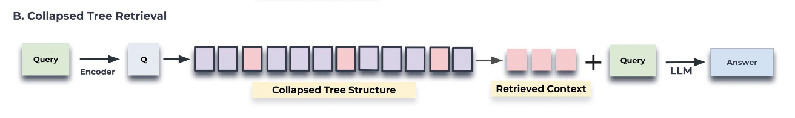

# RAPTOR: Recursive Abstractive Processing for Tree-Organized Retrieval

**Authors:** Parth Sarthi, Salman Abdullah, Aditi Tuli, Shubh Khanna  
**Venue:** ICLR 2025  
**Year:** 2026  
**Paper:** [https://arxiv.org/abs/2401.18059](https://arxiv.org/abs/2401.18059)  
**Category:** RAG  
**Tags:** `RAG`

---

## 📄 Abstract
Retrieval-augmented language models can better adapt to changes in world state and incorporate long-tail knowledge. However, most existing methods retrieve only short contiguous chunks from a retrieval corpus, limiting holistic understanding of the overall document context. We introduce the novel approach of recursively embedding, clustering, and summarizing chunks of text, constructing a tree with differing levels of summarization from the bottom up. At inference time, our RAPTOR model retrieves from this tree, integrating information across lengthy documents at different levels of abstraction. Controlled experiments show that retrieval with recursive summaries offers significant improvements over traditional retrieval-augmented LMs on several tasks. On question-answering tasks that involve complex, multi-step reasoning, we show state-of-the-art results; for example, by coupling RAPTOR retrieval with the use of GPT-4, we can improve the best performance on the QuALITY benchmark by 20% in absolute accuracy.

--- 

## 🎯 Key Contributions
1. RAG systems fail on thematic questions
2. For example, **How did Cinderella reach her happy ending?** cannot be answered from top-k retrieved passages alone.
3. Design an indexing system that uses tree structure to capture both high-level and low-level details about a text
4. RAPTOR clusters chunks of textst --> generates summaries of those clusters --> repeat
5. The tree is generated in a bottom-up fashion
6. Enables LLMs to load chunks of different granularity levels and effectively answer questions

---

## Approach

### Overview
1. Segment the corpus into short, contiguous texts of 100 words
2. If a sentence exceeds the 100-token limit, then the sentence is moved the next chunk
3. Embed the sentence using a sentence embedding model
4. The sentence and the embedding vector form the leaf nodes
5. Use a clustering algorithm to group similar texts
6. Once clustered, use a LLM to summarize the grouped texts
7. The summerized texts is re-embeddied

The process of embedding-clustering-summarizing continues until no further clustering is possible

### Clustering Algorithm
1. Soft clustering is used where a node can be part of multiple clusters
2. Individual text segments often contain information which can belong to multiple topics, hence they should be included as part of multiple summaries
3. Gaussian Mixture Models (GMMs) are used to cluster
4. GMMs assume that a data point is generated from a mixture of several gaussian distributions
5. Given a text and $K$ clusters, we denote the likelihood of the text having its membership in the $k^th$ Gaussian distribution
6. Uniform Manifold Approximation and Projection (UMAP), a manifold learning technique for dimensionality reduction
7. The number of nearest neighbors parameter, $n_neighbors$, in UMAP determines the balance between the preservation of local and global structure
8. The value of $n_neighbors$ is varied to create hierarchical clustering
9. First global clusters are identified and the local clusters within the group is identified
10. Bayesian Information Criterion (BIC) is employed to identify optimal number of clusters

### Model-Based Summarization
1. The nodes in each cluster are sent to a LLM for summarization
2. The summarization step condenses the potentially large volume of retrieved information into a manageable size

### Querying
Two types of querying

#### Tree Traversal
1. Select the top-k relevant root nodes based on cosine similarity with query embedding
2. The children of the selected root nodes are considered and top-k nodes are selected
3. The process is repeated till the leaf nodes are encountered
4. The text from all the relevant nodes are concatenated for retrieval
5. By adjusting the depth and. number of nodes selected , the specificity and the breadth of information retrieval can be controlled

#### Collapsed Tree
1. This approach flattens the multi-layered tree into a single layer
2. Calculate the cosine similarity between query embedding and all nodes in the collapsed set
3. Select the top-k nodes with highest cosine similarity
4. Concatenate the text and do the retrieval

> [!NOTE]
> When does the tree traversal algorithm know to stop?

> [!NOTE]
> Collapsed Tree outperforms Tree Traversal

---

## Experiments

### Datasets
1. NarrativeQA
    - QA pairs based on full texts of books and movie transcripts
    - Comprehensive understanding of the entire narrative in order to accurately answer its question
2. QASPER
    - Dataset from NLP papers with each question probing for information embedded within the full text
    - Answer types include: Answerable/Unanswerable, Yes/No, Abstractive, and Extractive
3. QuALITY
    - MCQAs with reasoning over entire document for answering

### Results
1. RAPTOR outperforms DPR and SBERT models

---

## 🏷️ Tags for Reference

#rag

---

**Date Read:** 2026-05-10  
**Status:** ✅ Completed
