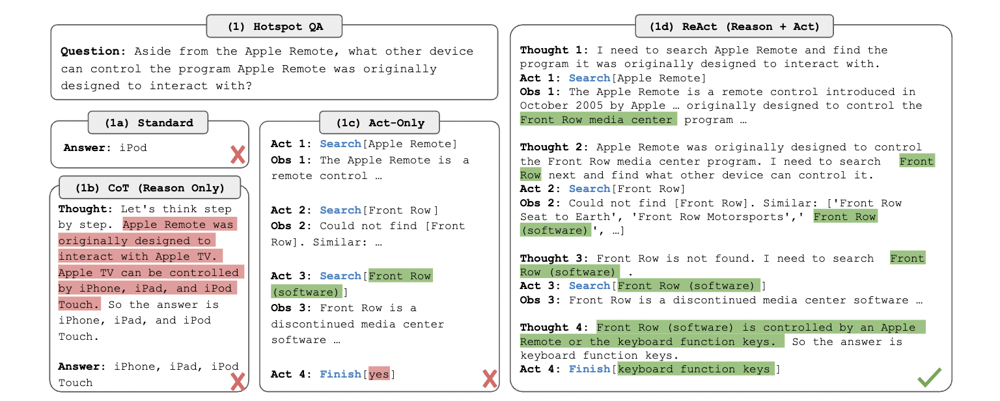
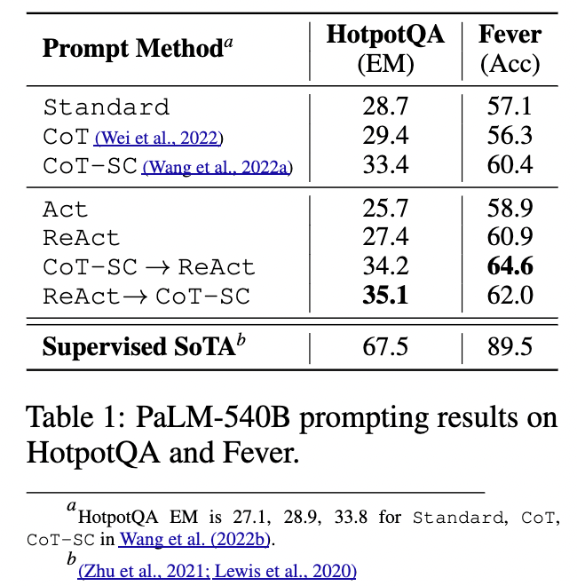

# ReAct: Synergizing Reasoning and Acting in Language Models

**Authors:** Shunyu Yao, Jeffrey Zhao, Dian Yu, Nan Du  
**Venue:** ICLR 2024  
**Year:** 2026  
**Paper:** [https://arxiv.org/abs/2210.03629](https://arxiv.org/abs/2210.03629)  
**Category:** RAG  
**Tags:** `RAG`

---

## 📄 Abstract
While large language models (LLMs) have demonstrated impressive capabilities across tasks in language understanding and interactive decision making, their abilities for reasoning (e.g. chain-of-thought prompting) and acting (e.g. action plan generation) have primarily been studied as separate topics. In this paper, we explore the use of LLMs to generate both reasoning traces and task-specific actions in an interleaved manner, allowing for greater synergy between the two: reasoning traces help the model induce, track, and update action plans as well as handle exceptions, while actions allow it to interface with external sources, such as knowledge bases or environments, to gather additional information. We apply our approach, named ReAct, to a diverse set of language and decision making tasks and demonstrate its effectiveness over state-of-the-art baselines, as well as improved human interpretability and trustworthiness over methods without reasoning or acting components. Concretely, on question answering (HotpotQA) and fact verification (Fever), ReAct overcomes issues of hallucination and error propagation prevalent in chain-of-thought reasoning by interacting with a simple Wikipedia API, and generates human-like task-solving trajectories that are more interpretable than baselines without reasoning traces. On two interactive decision making benchmarks (ALFWorld and WebShop), ReAct outperforms imitation and reinforcement learning methods by an absolute success rate of 34% and 10% respectively, while being prompted with only one or two in-context examples. Project site with code: this https URL

---

## 🎯 Motivation

1. Existing approaches isolate reasoning and action and study them separately.
2. CoT reasoning is a static black-box where the model uses internal representation to generate thoughts and is not grounded on the real world.
3. Need to study how reasoning and acting can be combined in a synergistic framework for general problem-solving.

---

## 🔍 ReAct

1. Consider an agent interacting with its environment for some task solving.
2. At each time step $t$, the agent observes $o_t$ and takes action $a_t$ according to some policy $\pi(a_t|c_t)$
3. Learning such a policy is challenging when the mapping $c_t \rightarrow a_t$ requires high computation.
4. ReAct incorporates reasoning trace or thought also as part of actions space. The reasoning will be using natural langauge and does not affect the external environment. 
5. ReAct looks at current context, thought and produces a new context which defines the next set of actions which needs to be taken.
6. Thoughts could be
    - decomposing task goals
    - creating action plans
    - injecting commonsense knowledge
    - extracting important parts from observation
    - tracking progress
    - adjust action plans
    - etc.
7. A LLM is prompted with few-shot examples and the current context and thought to generate the next action.

### KNOWLEDGE-INTENSIVE REASONING TASKS

Focus is on multi-hop question answering and fact verification tasks. The system can interact with Wikipedia API. HotpotQA and Fever datasets are considered.

#### Action Space:
1. search[entity]: returns the first 5 sentences from
the corresponding entity wiki page if it exists, or else suggests top-5 similar entities from the
Wikipedia search engine
2. lookup[string]: which would return the next sentence in the page
containing string.
3. finish[answer]: which would finish the current task with answer

#### Methodology:

1. We randomly select few-shot examples from the training set and manually compose ReAct trajectories.
2. Each trajectory contains multiple thought-action-observation steps

---

## Results

### Baselines
1. Standard Prompting: Remove all ReAct trajectories in few-shot examples
2. CoT Prompting: Removes action-observations steps from trajectories in few-shot examples
3. Acting-Only Prompt: Removes thought from treajectories in few-shot examples
4. ReAct $\rightarrow$ CoT-SC: When ReAct fails to answer in given steps the model falls back to CoT-SC.
5. CoT-SC $\rightarrow$ ReAct: When the majority answer using $n$ CoT-SC samples occurs less than $n/2$ times, fall back to ReAct.

ReAct outperforms all baselines on both datasets. 

> [!NOTE]
> Smaller models fares worse with ReAct due to the complexity of generating thought-action-observation steps. They benefit largely from finetuning.

### ReAct vs CoT

1. ReAct outperforms CoT on Fever but falls behind on HotpotQA dataset.
2. Hallucination is a serious problem for CoT
3. In ReAct, sometimes the model gets stuck in a loop generating previous thought-action-observation steps.
4. ReAct is heavily dependent on successful retrieval.

---

## 🏷️ Tags for Reference

#rag

---

**Date Read:** 2026-05-03  
**Status:** ✅ Completed
