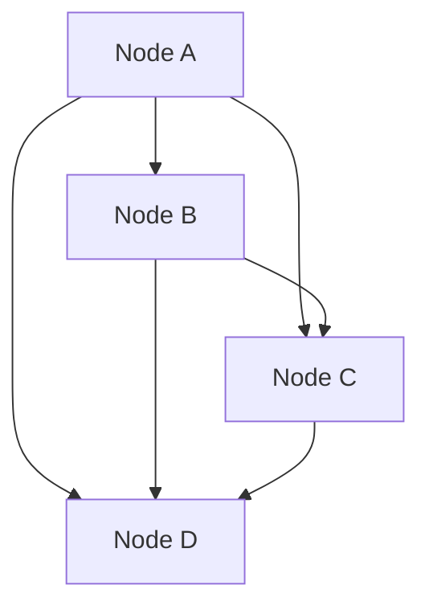

# Page Rank Algorithm

## Motivation
1. A search engine keeps an index of all webpages
2. Same information might be available on multiple pages
3. How do i know which webpages are more important?
4. Usefullness of a search engine depends on the relevance of the result it returns back
5. Importance of a webpage depends on how many webpages that link to it.

## Inituition
1. If we create a webpage add a link to another page, then we feel that another page is relevant
2. If there are a lot of webpages that link to a page, then it is more important

## Approach
1. Assume the webpages are nodes and the edges indicate that webpage i refers to webpage j.

2. Assume each node transfers the weight evenly to the connected node.
3. The transition matrix would look like this
$$
\begin{bmatrix}
0 & \frac{1}{3} & \frac{1}{3} & \frac{1}{3}\\
0 & 0 & \frac{1}{2} & \frac{1}{2} \\
0 & 0 & 0 & 1 \\
0 & 0 & 0 & 0 \\
\end{bmatrix}
$$

Suppose initially the importance is uniformly distributed among all 4 nodes, then we compute PageRank as follows

The initial PageRank vector is:

$$
r^{(0)} =
\begin{bmatrix}
\frac{1}{4} \\
\frac{1}{4} \\
\frac{1}{4} \\
\frac{1}{4}
\end{bmatrix}
$$

The transition matrix is:

$$
P =
\begin{bmatrix}
0 & \frac{1}{3} & \frac{1}{3} & \frac{1}{3}\\
0 & 0 & \frac{1}{2} & \frac{1}{2} \\
0 & 0 & 0 & 1 \\
0 & 0 & 0 & 0
\end{bmatrix}
$$

Then the next PageRank vector is computed as:

$$
r^{(1)} = P^T r^{(0)}
$$

Expanding the transpose:

$$
P^T =
\begin{bmatrix}
0 & 0 & 0 & 0 \\
\frac{1}{3} & 0 & 0 & 0 \\
\frac{1}{3} & \frac{1}{2} & 0 & 0 \\
\frac{1}{3} & \frac{1}{2} & 1 & 0
\end{bmatrix}
$$

Therefore,

$$
r^{(1)}
=
\begin{bmatrix}
0 \\
\frac{1}{12} \\
\frac{5}{24} \\
\frac{17}{24}
\end{bmatrix}
$$

Approximate decimal values:

$$
r^{(1)}
\approx
\begin{bmatrix}
0 \\
0.083 \\
0.208 \\
0.708
\end{bmatrix}
$$

This is repeated $k$ times until convergence.

> [!NOTE]
> Importance of a webpage is the probability that a random surfer will land on that page. The weights of the edges tells the probability that a random surfer will follow that edge.